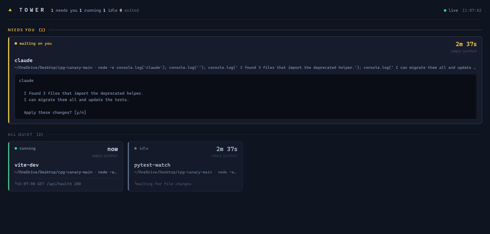

# tower

A live control tower for all of your terminal sessions.

You run a dev server in one terminal, a test watcher in another, an AI coding agent in a third, a build in a fourth. Tower answers one question at a glance: **which of my terminals needs me right now?** And since v1.5, a second one: **what was I doing in each of them?**



## Install

Not on npm yet (the name is still being chosen). Install from source:

```
git clone https://github.com/lloydlabsai/tower && cd tower
npm i -g .
```

Zero config, localhost-only. Without an API key, nothing ever leaves your machine.

## 60-second demo

Wrap any command with `tower run`. Your terminal behaves exactly as before; the session just also appears on the board.

```
tower run npm run dev        # terminal 1
tower run pytest -f          # terminal 2
tower run claude             # terminal 3
tower open                   # the status board
```

Sessions that need you (waiting for input, or exited with an error) sort to the top. Click a card to see its recent output, live.

Claude Code sessions appear on the board **even without `tower run`** — tower watches their transcript files (see below).

## Statuses

| status | meaning |
|---|---|
| `running` | process alive, output in the last 15 seconds |
| `idle` | process alive, quiet for a while |
| `waiting` | the last output line looks like a prompt (`? `, `: `, `[y/n]`, ...) and nothing has been printed since |
| `active` | (Claude Code sessions) transcript written to in the last 2 minutes |
| `exited-ok` / `exited-error` | from the exit code |
| `stale` | the wrapper lost contact; heals automatically on reconnect |

The waiting heuristic is deliberately dumb and easy to tune: it is a short list of regexes in `src/protocol.js`. Claude Code sessions go `waiting` when the assistant asked a question or requested plan approval (`src/claudewatch.js`).

## Summaries — the narrative layer

Bring your own Anthropic API key and every card gains a three-line story above the raw output: what the session is **doing**, what just happened (**last**), and the likely **next** step — so you can re-enter any terminal without scrollback archaeology.

```
tower config set anthropic_key    # prompts, input hidden, kept out of shell history
tower ls                          # now shows a DOING column
```

(`tower config set anthropic_key sk-ant-...` works too, at the cost of your shell history knowing. Either way the key is verified with a 1-token test call.)

- Summaries refresh only for sessions with meaningfully new output, every `summaries.interval_seconds` (default 180).
- Each summary carries an "as of Xm ago" stamp. The mechanical status is never derived from summaries.
- Exited sessions are summarized once (the closing chapter), then left alone.
- No key: the board is exactly the classic board, plus a one-time dismissible hint.

Config lives in `~/.tower/config.json` (created `0600`); `ANTHROPIC_API_KEY` in the environment also works, the file wins. Knobs:

| key | default | |
|---|---|---|
| `anthropic_key` | – | your key; `tower config get` masks it |
| `summaries.enabled` | `true` | flip off without deleting the key |
| `summaries.interval_seconds` | `180` | minimum 30 |
| `summaries.model` | a Haiku-class model | any Anthropic model id |
| `claude_projects_dir` | `~/.claude/projects` | where Claude Code keeps transcripts |

## Claude Code sessions

The daemon tail-reads `~/.claude/projects/**/*.jsonl` — the transcripts Claude Code already writes — and shows recently-active sessions as cards with an `agent` badge, Claude Code's own session title, the project directory, and the branch. No Claude Code installed means this feature silently does nothing.

- Transcript summaries come from the conversation turns (tool payloads and file dumps are skipped), so they tend to read better than scrollback-derived ones.
- A session that is *also* wrapped with `tower run claude` becomes one card: the transcript names the story, the wrapper's terminal state decides `waiting`.
- Cards drop off after 45 minutes of transcript silence.

## Privacy

**Without a key, tower sends nothing anywhere, ever.** No telemetry, no phoning home, no cloud.

With a key configured, the only network traffic is to the Anthropic Messages API (`api.anthropic.com`), and the only payloads are, per summarized session: its name, working directory, command line, up to ~120 recent lines of its terminal output (for Claude Code sessions: recent conversation text turns instead), and the previous summary. Terminal output can contain secrets — that is your terminal, your key, and your call. Requests are capped (~300 output tokens); unchanged sessions are never re-sent.

## CLI

```
tower run [--name <name>] <command> [args...]   wrap a command so it shows on the board
tower ls                                        list sessions in the terminal
tower open                                      open the status board in a browser
tower kill <name>                               stop a session ("daemon" stops towerd)
tower config get [key]                          show configuration (secrets masked)
tower config set <key> <value>                  set a value
tower config unset <key>                        remove a value
```

That is the whole surface.

## How it works

Three small pieces, about 2,900 lines total:

- **`towerd`**, a daemon that starts itself the first time you use tower. It keeps the session registry in memory, listens on a Unix domain socket, and serves the board on `http://127.0.0.1:8697`. The transcript watcher and the summarizer loop live inside it. Last-known state (summaries included) is persisted to `~/.tower/state.json`, so a daemon restart is not amnesia.
- **the wrapper** (`tower run`) spawns your command in a PTY, passes your terminal through untouched, and streams the last ~200 lines of output to the daemon. If the daemon dies, your process does not; the wrapper reconnects quietly in the background.
- **the board**, a single HTML page with vanilla JS, updated over server-sent events. Read-only: the board shows your terminals, it never types into them.

No database, no accounts, no cloud, no telemetry.

## Platform support

macOS and Linux. Windows is out of scope for v1, though most of it happens to work there (named pipe instead of a Unix socket, ConPTY via node-pty).

## Uninstall

```
tower kill daemon
npm rm -g tower-cli    # the package name from `npm ls -g`
rm -rf ~/.tower
```

## DECISIONS

Boring, conventional choices made during the build, recorded so they are arguable:

- **Node >= 18, one dependency.** `node-pty` is an `optionalDependency`; if its native build fails, `tower run` falls back to plain pipes (line-based programs work, full-screen TUIs see a non-TTY). Install never hard-fails.
- **SSE instead of websockets.** One-directional live updates need nothing more, and it keeps the dependency count at one.
- **Status is derived in the daemon,** not the wrapper: one clock, one implementation, and `tower ls` and the board can never disagree.
- **The ring buffer stores plain text.** ANSI escapes are stripped and carriage-return overwrites are collapsed, so progress bars show their latest state instead of 200 frames of spinner.
- **Port 8697** ("TOWR" on a phone keypad), falling back to an ephemeral port if taken; the real port lives in `~/.tower/daemon.json`.
- **`daemon` is a reserved session name** so `tower kill daemon` is unambiguous.
- **Exited cards expire after 30 minutes.** The board is a status board, not a history.
- **Session names are auto-generated from the command** (`npm-run-dev`), deduped with `-2`, `-3`; override with `--name`.
- **The npm package name is a placeholder and `"private": true` guards it.** `tower-cli` is already taken on npm by an unrelated package; this repo installs from source until a real name is secured.
- **A signal-killed child exits `128 + signum`** (shell convention) and shows as `exited-error`, even though PTYs report such deaths with exit code 0.

v1.5 additions:

- **Raw `fetch` to the Messages API, no SDK.** The dependency budget stays at one; the entire API surface used is a single POST endpoint. `src/anthropic.js` is ~70 lines.
- **The model id is config, not code.** It appears exactly once, as the default of `summaries.model`.
- **Summaries are annotations, never truth.** No status is ever derived from a summary, and every summarizer failure path (bad key, network, malformed output) leaves core tracking untouched. A rejected key surfaces one line and stops retrying until the key changes; other errors back off exponentially.
- **Transcript cards appear without a key.** The watcher reads local files; the key gates only API calls. "Zero regression without a key" is about behavior and nagging, not about hiding a read-only data source.
- **Agent `waiting` means an explicit ask** (question tool, plan approval, or trailing `?`), not merely a finished turn. The looser rule felt too shouty; it is parked in IDEAS.
- **Summaries persist in `state.json`** so a daemon restart does not re-bill unchanged sessions.
- **`TOWER_DIR` and `TOWER_ANTHROPIC_BASE_URL` env overrides are test seams** (temp state dirs, a local mock API); they are not supported configuration.
- **Cost posture:** max 6 summary calls per tick spent on whoever waited longest, ~120 lines / ~300 output tokens per call, unchanged buffers skipped, exited sessions summarized once (a guarantee that survives restarts and transient API failures). A busy day of summaries costs cents, not dollars.
- **The board rejects non-localhost Host headers.** It serves terminal output and transcript text; a DNS-rebinding page should read none of it.
- **`tower config set anthropic_key` prompts with hidden input.** Keys typed as arguments live forever in shell history; the argv form still works for scripts.
- **Model output is control-stripped before display.** Summaries land in terminals (`tower ls`); a hostile transcript talking the model into emitting escape sequences gets spaces instead.

## License

MIT
